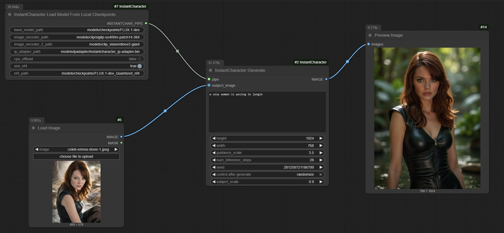

# ComfyUI-InstantCharacter-NF4

Wrapper for [Tencent's InstantCharacter](https://github.com/Tencent/InstantCharacter) in ComfyUI.

NF4 version runs on 24GB VRAM.

### Download models:
```bash
huggingface-cli download black-forest-labs/FLUX.1-dev --local-dir models/checkpoints/FLUX.1-dev --exclude "flux1-dev.safetensors"

huggingface-cli download priyesh17/FLUX.1-dev_Quantized_nf4 --local-dir models/checkpoints/FLUX.1-dev_Quantized_nf4

huggingface-cli download google/siglip-so400m-patch14-384 --local-dir models/clip/siglip-so400m-patch14-384

huggingface-cli download facebook/dinov2-giant --local-dir models/clip_vision/dinov2-giant --exclude "pytorch_model.bin"

wget -O models/ipadapter/instantcharacter_ip-adapter.bin "https://huggingface.co/tencent/InstantCharacter/resolve/main/instantcharacter_ip-adapter.bin?download=true"
```

